# JudoTV Project Structure

## 📁 Project Overview
```
judotv/
├── main.py
├── contest_monitor.py
├── streaming_session.py
├── mat.py
├── utils.py
└── README.md
```

---

## 📄 `main.py`

**Entry Point**
```python
def main() -> None:
    """
    Entry point: instancia ContestMonitor y lanza el flujo principal.
    """
```

---

## 🔍 `contest_monitor.py`

### `class ContestMonitor`

> Supervisa la API de JudoTV para detectar campeonatos en curso.
> Gestiona el polling periódico y dispara sesiones activas de streaming.

#### Methods
```python
def __init__(self, api_url: str, poll_interval: int = 30) -> None:
    """Constructor que inicializa el monitor"""

def run(self) -> None:
    """ Llama al resto de funciones """

def fetch_competition_schedule(self) -> None:
    """ Llama a fetch_competitions() y mapea comp_id -> comp_start_date"""

def fetch_competitions(self) -> list[dict[str, any]]:
    """Obtiene todos los torneos desde la API"""

def find_active_contest(self, contests: list[dict[str, any]]) -> dict[str, any] | None:
    """Retorna el torneo activo actualmente (si lo hay)"""

def start_monitoring(self) -> None:
    """Loop principal: busca torneos activos y lanza StreamingSession"""

def handle_active_competition(self, contest_data: dict[str, any]) -> None:
    """Crea y gestiona una sesión de streaming para el torneo detectado"""
```

---

## 📡 `streaming_session.py`

### `class StreamingSession`

> Representa una sesión de transmisión en vivo de un torneo.
> Coordina los tatamis, actualiza el estado en tiempo real y maneja websockets.

#### Methods
```python
def __init__(self, contest_id: int, metadata: dict[str, any]) -> None:
    """Constructor de la sesión"""

def load_contest_data(self) -> dict[str, any]:
    """Obtiene información detallada del torneo"""

def setup_tatamis(self, contest_data: dict[str, any]) -> None:
    """Inicializa objetos Mat a partir del JSON del torneo"""

def connect_websocket(self) -> None:
    """Conecta al websocket correspondiente para eventos en vivo"""

def handle_websocket_event(self, event_json: dict[str, any]) -> None:
    """Procesa un evento recibido por websocket (actualizaciones, cambios de combate, etc.)"""

def run(self) -> None:
    """Loop principal que mantiene viva la sesión"""
```

---

## 🥋 `mat.py`

### `class Mat`

> Representa un tatami dentro de un torneo activo.
> Gestiona el combate actual, resultados y estado del tatami.

#### Methods
```python
def __init__(self, mat_id: int, name: str) -> None:
    """Constructor del tatami"""

def update_state(self, mat_json: dict[str, any]) -> None:
    """Actualiza información del tatami (combate, atletas, marcador, etc.)"""

def get_current_match(self) -> dict[str, any] | None:
    """Devuelve información del combate actual"""

def print_scoreboard(self) -> None:
    """Muestra en consola el estado del combate (para debug o CLI)"""

def end_match(self) -> None:
    """Limpia estado cuando el combate finaliza"""
```

---

## 🛠️ `utils.py`

### Utility Functions
```python
def fetch_json(url: str, headers: dict[str, str] | None = None) -> dict[str, any]:
    """Hace una request GET y retorna el JSON parseado"""

def parse_championship_id(url: str) -> int:
    """Extrae el ID del torneo desde la URL"""

def calculate_current_championship_day(start_date: str) -> int:
    """Calcula el día del campeonato basado en la fecha de inicio"""

def websocket_json_parser(raw_message: str) -> dict[str, any]:
    """Convierte texto de websocket a JSON válido, manejando errores"""

def parse_start_date(date_str: str) -> datetime.datetime:
    """Convierte string ISO8601 a objeto datetime"""

def pretty_print(data: dict[str, any]) -> None:
    """Imprime JSON con indentación legible (para debug/logs)"""
```

---

## 🔄 Application Flow

```mermaid
graph TD
    A[main.py] --> B[ContestMonitor]
    B --> C{Torneo Activo?}
    C -->|Sí| D[StreamingSession]
    C -->|No| B
    D --> E[Setup Tatamis]
    E --> F[Connect Websocket]
    F --> G[Mat Objects]
    G --> H[Handle Events]
    H --> G
```


### Flow Description

1. **ContestMonitor** → Detecta torneo activo
2. **StreamingSession** → Gestiona transmisión en vivo del torneo
3. **Mat** → Representa cada tatami (combates)
4. **utils** → Helpers generales (requests, parsing, etc.)
5. **main.py** → Entry point

---

## 📝 README.md

Descripción general del proyecto y documentación del flujo modular.